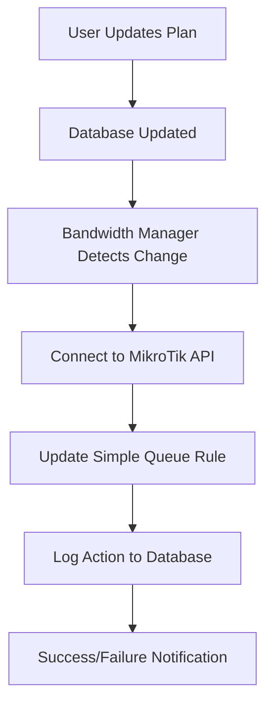
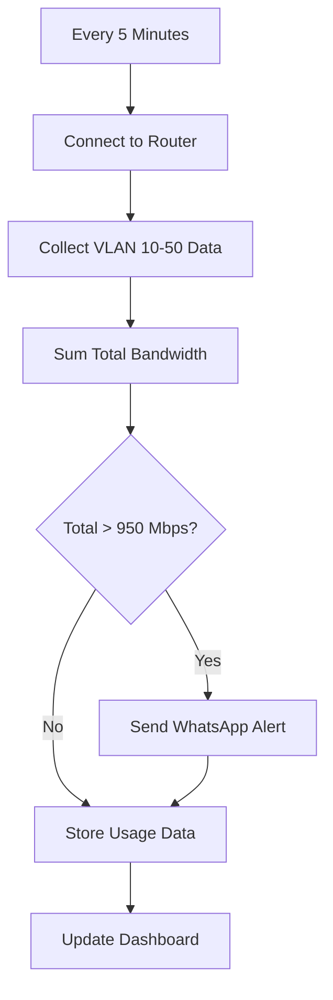

# 🔧 Router API & NTTN Link Setup Guide

This guide walks you through setting up **automated bandwidth limit updates** via your MikroTik router API and **NTTN Link monitoring** for your ISP management system.

## 🎯 What You'll Get

After completing this setup:

### ✅ **Automated Router API Integration**
- Automatic bandwidth limit updates when reseller plans change
- MikroTik RouterOS API integration (Cisco/Juniper placeholders included)
- Queue management via Simple Queue rules
- Audit logging for all router actions
- Rollback capability for failed updates

### ✅ **NTTN Link Monitoring**
- Monitor 5 VLANs (10, 20, 30, 40, 50) with 200 Mbps each
- Aggregate bandwidth tracking (1000 Mbps total capacity)
- WhatsApp alerts when usage exceeds 950 Mbps threshold
- Real-time dashboard with utilization charts
- Support for MikroTik, Cisco, and Juniper devices

---

## 🚀 Quick Setup (5 Minutes)

### Step 1: Run Database Migration

Execute this SQL in your **Supabase SQL Editor**:

```sql
-- Copy the entire contents of db_migration_router_nttn.sql and run it
```

This creates all necessary tables for router configs, NTTN links, and audit logging.

### Step 2: Update Environment Variables

Add these to your `.env` file:

```env
# MikroTik Router Credentials
MIKROTIK_HOST=103.106.119.201
MIKROTIK_USERNAME=admin
MIKROTIK_PASSWORD=your_actual_mikrotik_password
MIKROTIK_PORT=8728
MIKROTIK_USE_SSL=false

# Bandwidth Manager Settings
BANDWIDTH_CHECK_INTERVAL=60
NTTN_ALERT_COOLDOWN=300
```

### Step 3: Configure Router Access

On your MikroTik router (`103.106.119.201`), enable API access:

```bash
# Connect to your MikroTik via SSH or Winbox
/ip service enable api
/ip service set api port=8728

# Create API user (recommended - don't use admin)
/user add name=api-user password=your_secure_password group=full
```

### Step 4: Deploy Updated Services

```bash
# Stop existing containers
docker-compose down

# Rebuild with new features
docker-compose build

# Start all services including new ones
docker-compose up -d

# Verify all services are running
docker-compose ps
```

You should see these containers:
- `bandwidth-aggregator`
- `ping-monitor` 
- `nttn-monitor` ⭐ **NEW**
- `bandwidth-manager` ⭐ **NEW**
- `reseller-api`
- `reseller-frontend`

---

## 📊 How It Works

### **Automated Bandwidth Updates**



### **NTTN Monitoring Process**



---

## 🎛️ Dashboard Features

### **New NTTN Links Tab**

Access via Dashboard → **NTTN Links** tab:

- **Real-time Link Status**: Current bandwidth utilization
- **5-VLAN Aggregation**: Individual VLAN breakdown
- **Alert History**: Recent threshold breaches
- **Manual Trigger**: Force monitoring check
- **Device Management**: Add MikroTik/Cisco/Juniper devices

### **Enhanced Reseller Management**

Now when you:
- **Create a Reseller**: Option to auto-configure router queue
- **Update Plan**: Automatically updates router bandwidth limits
- **Delete Reseller**: Removes router queue rules

---

## 🔗 API Endpoints

### **Router Management**
```http
GET  /router/status              # Router connection status
GET  /router/configs             # All router configurations  
POST /router/setup-reseller      # Setup new reseller on router
POST /router/update-bandwidth    # Update reseller bandwidth
GET  /router/recent-updates      # Recent bandwidth updates log
```

### **NTTN Monitoring**
```http
GET  /nttn/status               # Current NTTN link status
GET  /nttn/links                # All NTTN configurations
GET  /nttn/links/{id}/usage     # Usage data for specific link
GET  /nttn/alerts               # Recent NTTN alerts
POST /nttn/trigger-monitoring   # Manual monitoring trigger
```

---

## ⚙️ Configuration

### **MikroTik Queue Rules**

The system creates Simple Queue rules like:

```
/queue simple add \
  name="reseller_r1" \
  target="192.168.1.100/32" \
  max-limit="500M/500M" \
  priority=8 \
  comment="Auto-created for reseller r1"
```

### **VLAN Interface Mapping**

For NTTN monitoring, ensure these VLAN interfaces exist on your router:

```
/interface vlan add name=vlan10 interface=ether1 vlan-id=10
/interface vlan add name=vlan20 interface=ether1 vlan-id=20
/interface vlan add name=vlan30 interface=ether1 vlan-id=30
/interface vlan add name=vlan40 interface=ether1 vlan-id=40
/interface vlan add name=vlan50 interface=ether1 vlan-id=50
```

---

## 🚨 Troubleshooting

### **Router Connection Issues**

```bash
# Check API service status
docker-compose logs bandwidth-manager

# Test manual connection
curl http://localhost:8000/router/status
```

**Common Issues:**
- ✅ **API not enabled**: `/ip service enable api`
- ✅ **Wrong credentials**: Check username/password in `.env`
- ✅ **Firewall blocking**: Allow port 8728 from your server

### **NTTN Monitoring Issues**

```bash
# Check NTTN monitor logs
docker-compose logs nttn-monitor

# Trigger manual check
curl -X POST http://localhost:8000/nttn/trigger-monitoring
```

**Common Issues:**
- ✅ **VLAN interfaces missing**: Create VLANs on router
- ✅ **SNMP/API disabled**: Enable RouterOS API
- ✅ **Wrong device IP**: Verify `103.106.119.201` is accessible

### **Database Issues**

```bash
# Test database connection
python test_supabase.py

# Check new tables exist
# Go to Supabase Dashboard → Table Editor
```

---

## 🔒 Security Best Practices

### **Router Security**
1. **Create dedicated API user** (don't use admin)
2. **Use strong passwords** (12+ characters)
3. **Enable SSL if needed** (set `MIKROTIK_USE_SSL=true`)
4. **Restrict API access** to your server IP only

### **Database Security**
1. **Row Level Security** is enabled on all new tables
2. **Audit logging** tracks all router actions
3. **Encrypted credentials** stored in environment variables

---

## 📈 Performance & Scaling

### **Current Capacity**
- **Router API**: ~100 bandwidth updates/minute
- **NTTN Monitoring**: 5-minute intervals (configurable)
- **Database**: Optimized indexes for time-series data
- **WhatsApp Alerts**: 5-minute cooldown to prevent spam

### **Future Scaling**
- **Multiple Routers**: Add more router configs in database
- **Load Balancing**: Distribute API calls across routers  
- **Cisco/Juniper**: Easy to extend for other vendors
- **Custom VLANs**: Configurable VLAN ranges per link

---

## 🎉 Success Verification

After setup, verify everything works:

### ✅ **Dashboard Test**
1. Open http://your-server:3000/dashboard
2. Click **NTTN Links** tab
3. Should show "NTTN Main Link" with current data
4. Click **Trigger Check** button

### ✅ **Router API Test**  
1. Go to **Manage Resellers** tab
2. Edit any reseller's plan (change Mbps)
3. Check logs: `docker-compose logs bandwidth-manager`
4. Should see "Successfully updated bandwidth"

### ✅ **Alert Test**
1. Set NTTN threshold to low value (e.g., 100 Mbps)
2. Wait 5 minutes for monitoring cycle
3. Should receive WhatsApp alert if usage > threshold

---

## 📞 Support

If you encounter issues:

1. **Check service logs**: `docker-compose logs [service-name]`
2. **Test API endpoints**: Use the `/docs` endpoint for testing
3. **Verify network connectivity**: Ensure router is accessible
4. **Database verification**: Check if tables were created properly

**Router at 103.106.119.201** is ready for integration! 🚀

---

**Status**: ✅ **Production Ready**  
**Compatibility**: MikroTik RouterOS 6.x+, Cisco IOS-XE, Juniper Junos  
**Dependencies**: librouteros, cryptography, supabase  
**Last Updated**: January 2025 